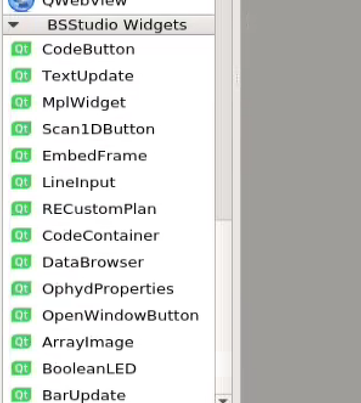
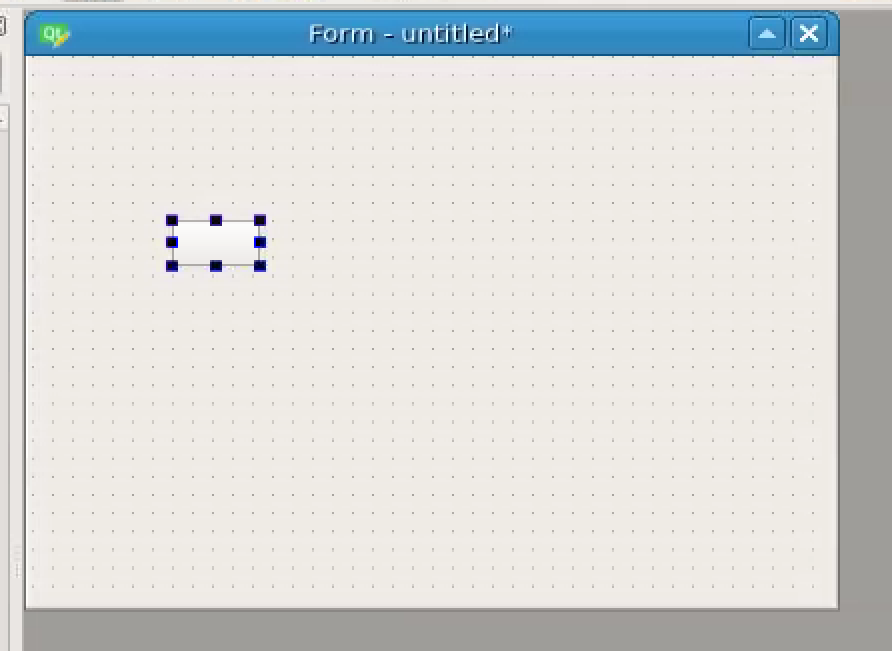
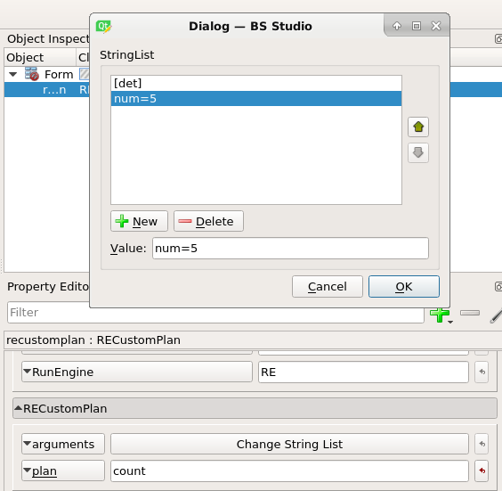

.. bsstudio documentation master file, created by
   sphinx-quickstart on Wed Sep 23 03:31:36 2020.
   You can adapt this file completely to your liking, but it should at least
   contain the root `toctree` directive.

BS Studio Documentation
====================================

.. toctree::
   :maxdepth: 2
   :caption: Contents:

Installation
============
The following creates an environment called bsstudio and installs BS Studio in it, along with its dependencies:

conda create --name bsstudio -c conda-forge -c bsobhani bsstudio

On some conda setups, you may have to specify the full url of the channels, like this:

conda create --name bsstudio -c https://conda.anaconda.org/conda-forge -c https://conda.anaconda.org/bsobhani bsstudio

You can also install using pip, by doing:

pip install bsstudio

At NSLS-II, I recommend keeping two separate environments: One where you run the designer and the other environment would be the bluesky collection environment. The reason I recommend keeping two separate environments is because the designer has stricter version requirements than running the screens, and you may run into problems if you impose version requirements on an environment shared by as many programs as the bluesky collection environment. I would install bsstudio in the designer environment using conda, and install bsstudio in the collection environment using pip.

Tutorial
===========

Once you have installed bsstudio, type "designer" to load the designer. When the designer opens, you will be presented with the following dialog:

.. image:: images/new_window.PNG

Select "Widget" and click "Ok". Next scroll to the bottom of the widgets panel on the left side of the screen. You should see this:

These are the BS Studio widgets. These are the widgets that you can drag and drop to create GUIs for Bluesky. 

Drag the RECustomPlan widget from the widgets panel onto the window.  It should look like this:

This can be used to run any Bluesky plan. Select the button and then turn your attention to the property panel on the right side of the screen. Fill in the fields as follows:

RunEngine: This is the name of your RunEngine object in bluesky. On NSLS-II beamlines, this will be "RE".

plan: This is the name of your plan function that you want the RunEngine to run.

arguments: Click "Change String List" and enter the arguments to your plan here. These can be either positional arguments or named arguments e.g. "num=5".

When you are finished, it should look something like this:

Next, save the file as "tutorial.ui". Then open bsui and type:

import bsstudio

bsstudio.load("tutorial.ui")
