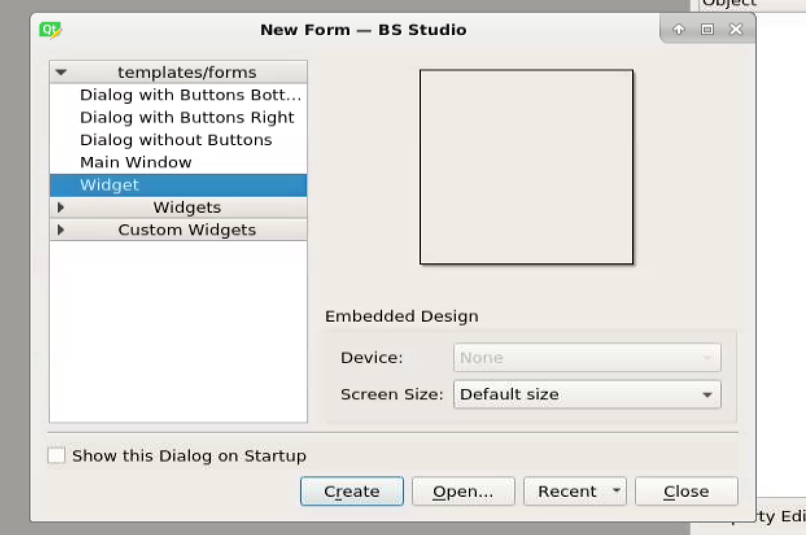

.. bsstudio documentation master file, created by
   sphinx-quickstart on Wed Sep 23 03:31:36 2020.
   You can adapt this file completely to your liking, but it should at least
   contain the root `toctree` directive.

Welcome to bsstudio's documentation!
====================================

.. toctree::
   :maxdepth: 2
   :caption: Contents:

.. image:: images/Bikesgray.jpg

Indices and tables
==================

* :ref:`genindex`
* :ref:`modindex`
* :ref:`search`

Hello World
===========

Once you have installed bsstudio, type "designer" to load the designer. When the designer opens, you will be presented with the following dialog:

Select "Widget" and click "Ok". Next scroll to the bottom of the widgets panel on the left side of the screen. You should see this:

These are the BS Studio widgets. These are the widgets that you can drag and drop to create GUIs for Bluesky. 

For this tutorial, we will only use one of the most primitive but also very powerful widgets called the "CodeButton". Drag the CodeButton widget from the widgets panel onto the window. It should look like this:

.. image:: images/drag_button.PNG

Next, turn your attention to the property panel on the right side of the screen, and scroll down until you see the "code" field:

Click on the 3 dots to edit the code the button runs when pressed. You should see the following screen:

.. image:: images/edit_text.PNG

Change the print statement to say "print('Hello world')"

Finally, change the display text on your button:

Save the file as "hello.ui", and run the GUI by opening bluesky and typing:

import bsstudio
bsstudio.load("hello.ui") 

You should then see the following.

.. image:: images/hello_world_demo.PNG

Click button and it should print "Hello World" each time it is clicked.
